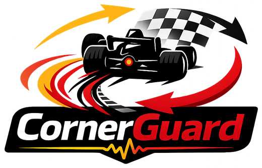

<p align="center">
  
</p>

# CornerGuard ML

Predictive vehicle stability warning for racing telemetry.

CornerGuard ML estimates the probability that a vehicle will enter an unstable
state in the next second if the current driver inputs continue. Instead of
waiting for obvious understeer, oversteer, or spin behavior, the first version
learns from the last two seconds of steering, yaw, speed, and acceleration
telemetry and emits a `stable`, `warning`, or `critical` state.

## Motivation

Most telemetry dashboards answer the question: "What happened?"

CornerGuard tries to answer the more useful racing question: "What is about to happen if the driver keeps doing this?"

Human driver reaction time is often around 700-1500 ms, and many vehicle stability systems react only once instability has already started. A predictive warning that arrives 0.5-1.5 seconds earlier can give a driver or race engineer time to recognize a developing understeer, oversteer, or track-exit risk before the car is obviously out of shape.

That is why this project is worth building. It turns ordinary steering and IMU telemetry into a future-risk signal:

- `stable`: current inputs look controlled.
- `warning`: the car is approaching the grip limit.
- `critical`: the current trajectory is likely to produce loss of control soon.

That makes CornerGuard more than a dashboard. It is a predictive driver-feedback and race-engineering system, and it creates a strong controls/ML project for autonomy, robotics, and motorsport recruiting.

For a race car, this is especially useful because the car is often operating near the tire grip limit by design. Small changes in steering, speed, brake release, throttle application, or track surface can turn a fast corner into understeer, oversteer, or a track-exit risk very quickly. CornerGuard gives the team a way to quantify that risk, compare drivers and setups, and learn which inputs consistently push the car toward instability.

The repo currently contains two layers:

- `src/` and `include/`: existing STM32 firmware for reading an LSM6DS33 IMU and
  sending IMU frames over CAN.
- `cornerguard_ml/`: host-side simulator, labeler, feature builder, baseline
  model training, and replay inference tools.

## Architecture

```text
STM32 IMU node / simulator
        |
        v
100 Hz telemetry stream
        |
        v
2 s rolling feature window
        |
        v
future instability classifier
        |
        v
stable / warning / critical
```

## Telemetry Schema

CSV files use one row per sample:

```csv
time_s,speed_mps,steering_angle_rad,steering_rate_radps,yaw_rate_radps,lateral_accel_mps2,throttle,brake
```

Training data adds:

```csv
label,loss_of_control_probability
```

Labels are generated by looking one second into the future:

- `stable`: no future tire saturation or large yaw error.
- `warning`: future state approaches the friction limit.
- `critical`: future state exceeds the friction limit or yaw behavior diverges.

## Quick Start

Create a virtual environment and install dependencies:

```bash
python3 -m venv .venv
source .venv/bin/activate
pip install -e ".[ml,test]"
```

Generate simulator data:

```bash
python scripts/generate_sim_data.py --runs 200 --out data/processed/simulated_cornering.csv
```

Train a baseline model:

```bash
python scripts/train_baseline.py \
  --data data/processed/simulated_cornering.csv \
  --model-out models/cornerguard_baseline.joblib
```

Replay telemetry as if it were live:

```bash
python scripts/replay_inference.py \
  --data data/processed/simulated_cornering.csv \
  --model models/cornerguard_baseline.joblib
```

## Roadmap

1. Add wheel speed, throttle, and brake pressure to the firmware CAN stream.
2. Validate the bicycle-model simulator against recorded runs.
3. Train a Random Forest or XGBoost baseline on 2 second windows.
4. Move inference to a Jetson, Raspberry Pi, or embedded target.
5. Replace the baseline with an LSTM, Temporal CNN, or transformer sequence
   predictor once real telemetry volume is high enough.

## Safety Note

This is a research and driver-feedback prototype. It should not command brakes,
steering, throttle, or any other actuator without a full safety case and track
testing process.
